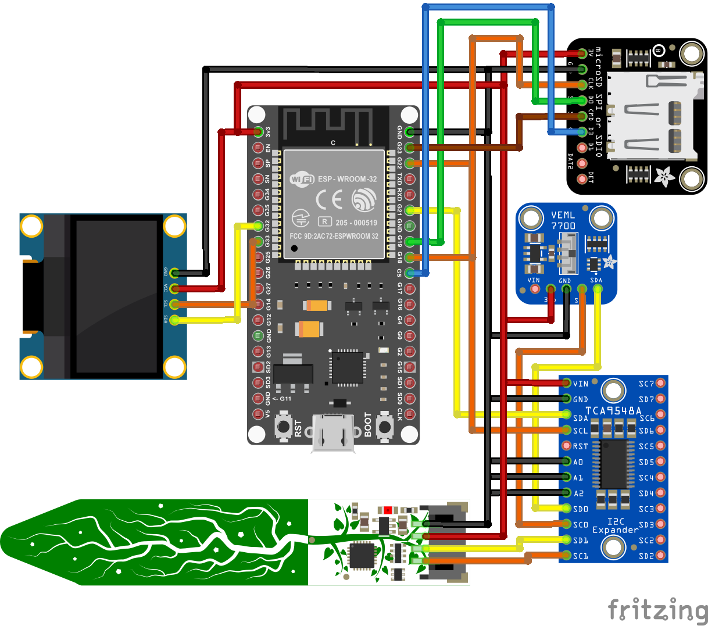

<h1>Plant Monitoring</h1>
   

  This is an ESP32-based plant monitoring project created using PlatformIO and the Arduino framework. We plan on incorporrating an Android app with Gemini (TBA).
    

  </img>

  <h3>Parts Used:</h3>
  <ul>
    <li>ESP-WROOM-32 Dev kit</li>
    <li>SSD1306 128x64 OLED LCD Screen (I2C)</li>
    <li>Adafruit STEMMA Soil Sensor</li>
    <li>Adafruit MicroSD SPI Breakout Board</li>
    <li>TCA9548A Multiplexer</li>
    <li>VEML7700 Ambient Light Sensor</li>
  </ul>

  <h3>Libraries:</h3>
  <ul>
    <li>Adafruit seesaw</li>
    <li>Adafruit VEML7700</li>
    <li>Adafruit SSD1306</li>
  </ul>

  <h3>Contributions:</h3>
  <ul>
    <li><b>Microcontroller programming</b>: Dorian Yeh </li>
  <li><b>Application development</b>: Owen Loughran </li>

